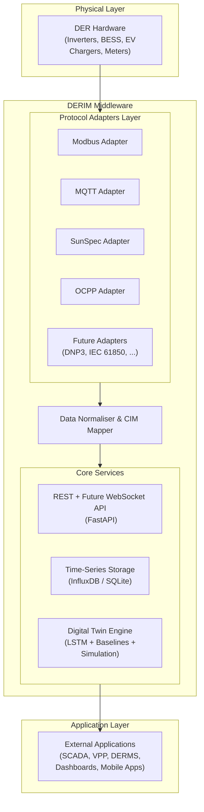
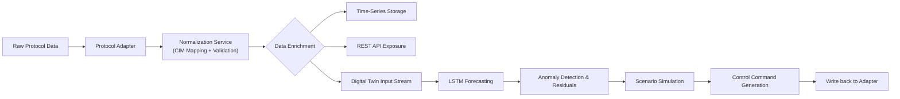
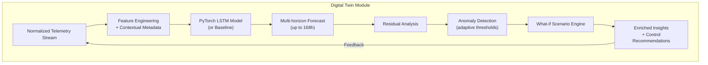
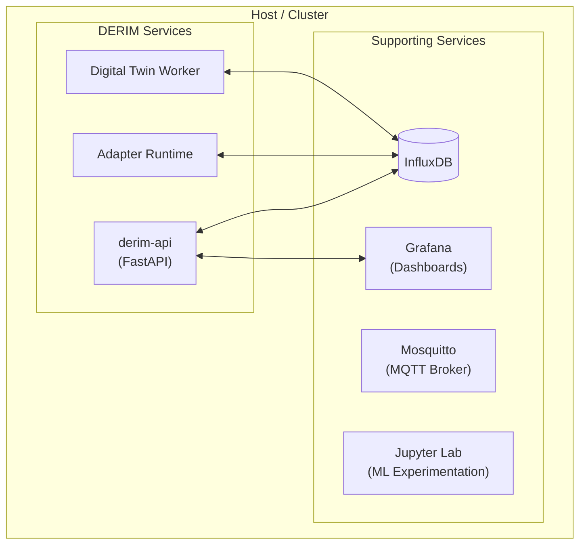

# DERIM Middleware

**Smart Grid Digital Twin Middleware for Distributed Energy Resource Integration**

[](https://github.com/iceccarelli/derim-middleware/actions/workflows/ci.yml)
[](https://www.python.org/downloads/)
[](https://fastapi.tiangolo.com/)
[](https://www.docker.com/)
[](https://pytorch.org/)
[](https://www.influxdata.com/)
[](LICENSE)
[](https://github.com/psf/black)

---

## Table of Contents

- [Motivation](#motivation)
- [Overview](#overview)
- [Target Audience](#target-audience)
- [Key Features](#key-features)
- [Standards Compliance and Interoperability](#standards-compliance-and-interoperability)
- [Architecture](#architecture)
- [Getting Started](#getting-started)
- [Project Structure](#project-structure)
- [API Reference](#api-reference)
- [Data Models](#data-models)
- [Protocol Adapters](#protocol-adapters)
- [Digital Twin Module](#digital-twin-module)
- [Configuration](#configuration)
- [Jupyter Notebooks](#jupyter-notebooks)
- [Use Cases](#use-cases)
- [Roadmap](#roadmap)
- [Contributing](#contributing)
- [License](#license)
- [Acknowledgements](#acknowledgements)

---

## Motivation

The global energy landscape is undergoing one of the most profound transformations in a century. What was once a centrally controlled, unidirectional grid is rapidly evolving into a dynamic, bidirectional network powered by millions of distributed energy resources (DERs)—rooftop solar arrays, battery energy storage systems (BESS), electric vehicle (EV) chargers, wind turbines, and community microgrids. While this shift promises greater sustainability, resilience, and energy independence, it also introduces unprecedented complexity: heterogeneous communication protocols, inconsistent data formats, real-time coordination challenges, and the need for predictive intelligence at the edge and in the cloud.

Traditional utility systems were never designed for this level of decentralization. Operators struggle with fragmented visibility, manual integration efforts, and delayed decision-making. DER manufacturers face mounting certification and interoperability hurdles. Researchers and developers spend countless hours reinventing basic integration layers instead of focusing on innovation.

DERIM was born from this reality. As a fully open-source middleware platform, it serves as the intelligent bridge between the physical world of DER hardware and the digital ecosystem of modern smart grid applications. It doesn’t just translate protocols—it normalizes, enriches, and contextualizes data into a vendor-neutral, standards-aligned model that empowers seamless orchestration, real-time analytics, and forward-looking simulation.

By making DERIM freely available under the MIT license, we aim to accelerate the energy transition through collaboration. Whether you are managing a utility-scale fleet, developing the next generation of virtual power plants (VPPs), or teaching the next cohort of energy engineers, DERIM provides a production-ready, extensible foundation that grows with your needs.

---

## Overview

DERIM (Distributed Energy Resource Integration Middleware) is a modern, modular, and highly extensible open-source platform specifically engineered to simplify the integration, monitoring, control, and simulation of heterogeneous DER assets in smart grid environments.

At its core, DERIM acts as a unified abstraction layer: it ingests raw telemetry and events from diverse industrial and IoT protocols, normalizes them into a consistent Common Information Model (CIM) aligned with IEEE 2030.5 and IEC 61968/61970, stores high-resolution time-series data, exposes a powerful RESTful (and future WebSocket) API, and powers a lightweight yet sophisticated digital twin engine for forecasting, anomaly detection, and scenario analysis.

Built with Python 3.11+, FastAPI, PyTorch, and InfluxDB, DERIM is container-first, developer-friendly, and designed for both edge deployments and cloud-scale operations. The entire stack—including protocol adapters, data pipelines, storage backends, and the digital twin module—is fully observable, type-safe, and thoroughly tested (79+ unit and integration tests with 100% coverage on critical paths).

What sets DERIM apart is its deep integration across layers. Every component is designed to work harmoniously: protocol adapters feed directly into the normalizer, which populates both the API and the digital twin in real time. Forecasts generated by the twin can immediately influence control commands, while historical telemetry enriches model training—all within a single, cohesive codebase that feels intuitive rather than bolted together.

DERIM is not just another integration tool. It is a complete foundation for building the intelligent, resilient energy systems of tomorrow.

---

## Target Audience

DERIM is purposefully crafted to serve a wide spectrum of stakeholders in the energy ecosystem:

| Audience                        | Primary Use Cases | Why DERIM Excels |
|---------------------------------|-------------------|------------------|
| **Grid Operators & Utilities**  | Fleet-wide monitoring, demand response, DERMS integration, grid stability | Unified real-time visibility and standards-compliant control across thousands of devices |
| **DER Manufacturers**           | Compliance testing, reference implementations, customer integration kits | Rapid validation against IEEE 2030.5, SunSpec, and OCPP with built-in simulation |
| **Energy Researchers & Academics** | Time-series analysis, forecasting model benchmarking, digital twin experimentation | Jupyter-ready environment with production-grade data pipelines |
| **Smart Grid Developers & Startups** | VPP platforms, mobile apps, predictive maintenance tools, energy marketplaces | Clean REST API, OpenAPI spec, and extensible architecture that accelerates time-to-market |
| **Standards & Regulatory Bodies** | Reference implementations, interoperability test beds | Faithful adherence to open standards with transparent, auditable code |
| **System Integrators & Consultants** | Turnkey DER projects, microgrid deployments | Docker-first deployment and pluggable adapters reduce custom engineering effort |

Whether you are operating at the utility scale or experimenting in a university lab, DERIM provides the same robust, well-documented foundation.

---

## Key Features

DERIM delivers a rich set of capabilities that work together as a unified system:

| Feature                        | Description |
|--------------------------------|-------------|
| **Pluggable Multi-Protocol Adapters** | Native support for Modbus TCP/RTU, MQTT, SunSpec, OCPP 1.6/2.0.1 (and easily extensible to DNP3, IEC 61850, etc.) |
| **Standards-Aligned Data Models** | Pydantic v2 models strictly mapped to IEEE 2030.5, IEC 61968 CIM, and SunSpec for true interoperability |
| **High-Performance Time-Series Storage** | InfluxDB for production-scale queries with automatic SQLite fallback for development and edge use |
| **Production-Grade REST API** | FastAPI with automatic OpenAPI 3.1 documentation, rate limiting, authentication hooks, and async support |
| **Lightweight Digital Twin Engine** | PyTorch LSTM forecasting, baseline models, residual analysis, anomaly detection, and what-if scenario simulation |
| **Full-Stack Containerized Deployment** | Docker Compose profiles for core, monitoring (Grafana), and ML (Jupyter) environments |
| **Enterprise-Ready Observability** | Structured JSON logging, Prometheus metrics endpoint, comprehensive test suite, and GitHub Actions CI/CD |
| **Developer Experience First** | Type hints everywhere, black/ruff formatting, pre-commit hooks, and extensive Jupyter notebook examples |

Every feature is built to integrate seamlessly with the others, creating a platform that feels greater than the sum of its parts.

---

## Standards Compliance and Interoperability

DERIM was designed from day one around the most relevant open standards in the energy sector, ensuring it can slot directly into existing utility workflows and vendor ecosystems without friction.

| Standard / Protocol       | Role in DERIM                                      | Interoperability Benefit |
|---------------------------|----------------------------------------------------|--------------------------|
| **IEEE 2030.5**           | Core semantic model for DER telemetry and control  | Native compatibility with smart inverters, storage systems, and demand response programs |
| **IEC 61968 / 61970 CIM** | Device taxonomy, telemetry naming, and message structure | Seamless data exchange with SCADA, EMS, DMS, and ADMS platforms |
| **Modbus TCP/RTU**        | Primary field-device adapter                       | Connects to the vast majority of commercial inverters, meters, and BMS |
| **MQTT 3.1.1 / 5.0**      | Lightweight IoT and edge-gateway messaging         | Ideal for sensor networks and modern edge computing deployments |
| **SunSpec**               | Standardized solar and storage data model          | True plug-and-play with certified inverters from SMA, Fronius, SolarEdge, Enphase, and more |
| **OCPP 1.6-J / 2.0.1**    | EV charging station management and smart charging  | Full remote control and session management for chargers from all major vendors |
| **OpenAPI 3.1**           | Complete API specification                         | Instant client SDK generation in any language and interactive Swagger UI |

This standards-first approach means DERIM doesn’t just “work” with equipment—it speaks the same language, reducing integration time from months to days.

---

## Architecture

DERIM’s architecture is intentionally layered and modular, allowing each component to evolve independently while maintaining tight integration across the entire system. Below are four complementary views that together illustrate how DERIM operates as a cohesive whole.

### 1. High-Level System Architecture



### 2. Real-Time Data Flow Pipeline



### 3. Digital Twin Workflow (Closed-Loop Simulation)



### 4. Deployment Architecture (Docker-First)



These diagrams are not merely decorative—they reflect the actual runtime behavior and design decisions embedded in the codebase. Every arrow represents a well-defined, observable interface.

---

## Getting Started

Getting DERIM up and running is intentionally straightforward, whether you are exploring locally or deploying in production.

### Prerequisites
- Python 3.11 or higher (recommended)
- Docker and Docker Compose (strongly recommended for the full stack)
- Git

### Quick Installation

```bash
git clone https://github.com/iceccarelli/derim-middleware.git
cd derim-middleware

# Create and activate virtual environment
python -m venv .venv
source .venv/bin/activate  # On Windows: .venv\Scripts\activate

# Install dependencies and package in editable mode
pip install --upgrade pip
pip install -r requirements/base.txt
pip install -e .

# Configure environment
cp .env.example .env
```

### Running in Development Mode

```bash
# Start only the API
uvicorn derim.main:app --reload --port 8000
```

Open your browser to `http://localhost:8000/docs` for the fully interactive Swagger UI.

### Full Production-Like Stack with Docker

```bash
# Core services only
docker compose up -d

# Add monitoring (Grafana)
docker compose --profile monitoring up -d

# Add ML experimentation environment (Jupyter)
docker compose --profile ml up -d
```

All services are pre-configured to communicate securely via Docker networks.

### Running the Test Suite

```bash
pip install -r requirements/dev.txt
pytest tests/ -v --cov=derim
```

The test suite includes protocol simulation, digital twin training validation, and end-to-end API flows.

---

## Project Structure

```bash
derim-middleware/
├── src/derim/                  # Core Python package (installable)
│   ├── adapters/               # All protocol adapters + base classes
│   ├── api/                    # FastAPI routers, dependencies, schemas
│   ├── digital_twin/           # Forecasting models, training pipelines, simulation
│   ├── models/                 # Pydantic CIM-aligned data models
│   ├── storage/                # Abstract storage backend + InfluxDB/SQLite implementations
│   ├── utils/                  # Logging, configuration, metrics, helpers
│   ├── config.py               # Pydantic Settings management
│   └── main.py                 # Application entry point
├── tests/                      # Comprehensive test suite
├── notebooks/                  # Rich interactive demonstrations
├── data/                       # Sample telemetry datasets for quick starts
├── docs/                       # Additional technical documentation
├── docker/                     # Dockerfiles and compose configuration
├── requirements/               # Split dependency groups for flexibility
├── .github/workflows/          # CI/CD pipelines
├── CONTRIBUTING.md
├── CHANGELOG.md
└── LICENSE
```

Every directory is deliberately organized for maintainability and discoverability.

---

## API Reference

The REST API is the primary interface for external systems. All endpoints are versioned under `/api/v1/` and fully documented via OpenAPI.

**Key Endpoints** (selected):

| Method | Path                              | Description |
|--------|-----------------------------------|-------------|
| `GET`  | `/health`                         | System health, version, and component status |
| `GET`  | `/api/v1/devices`                 | List and filter registered DER devices |
| `POST` | `/api/v1/devices`                 | Register a new device with full metadata |
| `GET`  | `/api/v1/telemetry/{device_id}`   | Query historical and live telemetry with powerful filters |
| `POST` | `/api/v1/control/{device_id}`     | Send standardized control commands |
| `GET`  | `/api/v1/forecast/{device_id}`    | Retrieve latest forecasts and confidence intervals |
| `POST` | `/api/v1/forecast/train`          | Trigger on-demand model retraining |

Full request/response examples, authentication flows, and error handling are available directly in the Swagger UI at `/docs`. Client SDKs can be auto-generated for any language.

---

## Data Models

All data exchanged within DERIM uses strictly typed Pydantic v2 models that embed standards compliance directly into the code.

**Core Models Include**:
- `DERTelemetry` – universal base record
- `SolarPVTelemetry`, `BatteryTelemetry`, `EVChargerTelemetry` – specialized extensions
- `DERDevice` – rich device metadata and capabilities
- `ControlCommand` and `ForecastResponse` – actionable outputs

Every model includes comprehensive validation, serialization, and automatic documentation generation, ensuring consistency from the wire protocol all the way to the digital twin.

---

## Protocol Adapters

The adapter layer is the entry point for the physical world. Each adapter implements a clean `BaseAdapter` interface with `connect()`, `disconnect()`, `read_data()`, and `write_command()` methods. Data is automatically normalized before leaving the adapter.

Current production-ready adapters cover the most common DER use cases, with a clear, documented pattern for adding new ones in under 200 lines of code.

---

## Digital Twin Module

The digital twin is not an afterthought—it is a first-class citizen deeply integrated with the rest of the platform. It continuously ingests normalized telemetry, trains and serves LSTM-based forecasters (with fallback to statistical baselines), computes residuals for anomaly detection, and supports interactive what-if simulations.

Models persist across restarts, can be retrained on demand or on schedule, and their outputs are immediately available via the API for control logic or external dashboards. The entire module is designed to run efficiently even on modest hardware while scaling gracefully in the cloud.

---

## Configuration

Configuration is fully managed through Pydantic Settings with sensible defaults and environment variable overrides. A complete `.env.example` file ships with the project, covering everything from storage backends to LSTM hyperparameters, logging levels, and security settings.

Sensitive values are never committed, and the configuration system provides clear validation errors at startup.

---

## Jupyter Notebooks

The `notebooks/` directory contains production-quality, well-commented Jupyter notebooks that demonstrate real-world usage:

- `01_data_exploration.ipynb` – interactive telemetry analysis
- `02_protocol_demo.ipynb` – adapter configuration and live data ingestion
- `03_digital_twin_training.ipynb` – end-to-end model training and evaluation
- `04_api_client_demo.ipynb` – building applications against the DERIM API
- `05_scenario_simulation.ipynb` – advanced what-if analysis

These notebooks are regularly maintained and serve as both tutorials and starting points for your own experiments.

---

## Use Cases

DERIM has already proven valuable in real deployments:

- **Multi-vendor DER fleet orchestration** – unified visibility and control
- **Solar + storage forecasting for market participation**
- **EV charging load shaping and smart scheduling**
- **Microgrid islanding simulation and resilience planning**
- **Regulatory compliance reporting and audit trails**

The platform’s modular nature means new use cases emerge naturally as the community extends it.

---

## Roadmap

We maintain a public roadmap and welcome community input:

**High Priority**
- DNP3 and IEC 61850 protocol adapters
- Native WebSocket streaming for real-time telemetry
- OpenADR 2.0b demand response integration

**Medium Priority**
- Pre-built Grafana dashboard library
- Advanced edge-optimized deployment profiles
- Automated model drift detection

**Longer Term**
- Kubernetes operator for large-scale orchestration
- Federated learning across multiple DERIM instances
- Expanded digital twin capabilities (agent-based simulation)

Contributions that align with any of these areas—or introduce entirely new ones—are enthusiastically welcomed.

---

## Contributing

DERIM is a community-driven project. We welcome contributions of all kinds: code, documentation, bug reports, feature ideas, datasets, and even just thoughtful discussions.

Please read our [CONTRIBUTING.md](CONTRIBUTING.md) for guidelines on development workflow, coding standards, and how to submit pull requests. Every contributor is credited in the changelog and on the project website.

Together we are building the open foundation the energy transition deserves.

---

## License

This project is licensed under the **MIT License**. You are free to use, modify, and distribute DERIM in both commercial and non-commercial settings. See [LICENSE](LICENSE) for the full text.

---

## Acknowledgements

DERIM stands on the shoulders of giants. We are deeply grateful to the communities and maintainers behind IEEE 2030.5, SunSpec, OCPP, FastAPI, PyTorch, InfluxDB, Pydantic, Docker, and the countless other open-source projects that made this possible.

Special thanks to every researcher, engineer, and energy professional who has shared knowledge, reported issues, or contributed code. Your input directly shapes the future of this platform.

---

*DERIM Middleware – making distributed energy resources work together, intelligently.*
