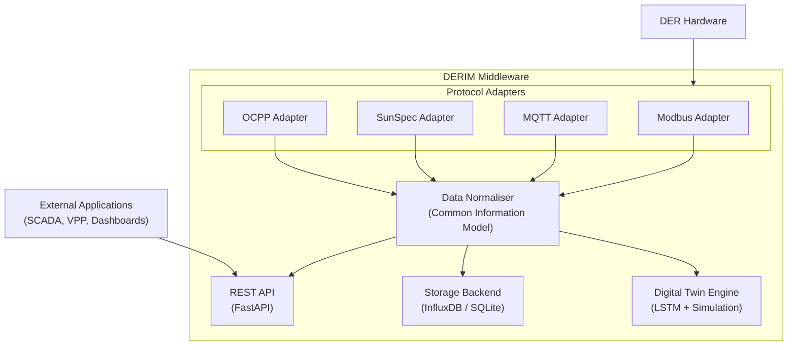

# DERIM Middleware

**Smart Grid Digital Twin Middleware for Distributed Energy Resource Integration**

[](https://github.com/iceccarelli/derim-middleware/actions/workflows/ci.yml)
[](https://www.python.org/downloads/)
[](https://fastapi.tiangolo.com/)
[](https://www.docker.com/)
[](https://pytorch.org/)
[](https://www.influxdata.com/)
[](LICENSE)
[](https://github.com/psf/black)

---

## Table of Contents

- [Motivation](#motivation)
- [Overview](#overview)
- [Target Audience](#target-audience)
- [Key Features](#key-features)
- [Standards Compliance and Interoperability](#standards-compliance-and-interoperability)
- [Architecture](#architecture)
- [Getting Started](#getting-started)
- [Project Structure](#project-structure)
- [API Reference](#api-reference)
- [Data Models](#data-models)
- [Protocol Adapters](#protocol-adapters)
- [Digital Twin Module](#digital-twin-module)
- [Configuration](#configuration)
- [Jupyter Notebooks](#jupyter-notebooks)
- [Use Cases](#use-cases)
- [Roadmap](#roadmap)
- [Contributing](#contributing)
- [License](#license)
- [Acknowledgements](#acknowledgements)

---

## Motivation

The global energy system is transitioning toward greater decentralisation. Millions of distributed energy resources — rooftop solar panels, battery storage systems, electric vehicle chargers, and community microgrids — are connecting to grids originally designed for unidirectional power flow. This shift introduces challenges related to protocol diversity, data normalisation, real-time visibility, and coordinated control.

DERIM is an open-source middleware platform developed to help address these integration challenges. It acts as a translation and normalisation layer between physical hardware and higher-level grid applications, providing a consistent, standards-aligned foundation that developers and operators can build upon.

> "Reliable integration software will be essential to making distributed energy resources work together effectively."

---

## Overview

DERIM (Distributed Energy Resource Integration Middleware) is a modular, open-source platform that bridges heterogeneous distributed energy resources and modern smart grid management systems. It ingests real-time data via industrial protocols, normalises it into a vendor-neutral model aligned with IEEE 2030.5 and IEC 61968 CIM, persists time-series telemetry, exposes a RESTful API, and includes lightweight digital twin functionality for forecasting and basic anomaly detection.

The platform is intended for grid operators, DER manufacturers, energy researchers, and smart grid developers who require a maintainable, extensible base for integration and analysis at various scales.

### Target Audience

| Audience                        | Primary Use Cases |
|---------------------------------|-------------------|
| **Grid Operators & Utilities**  | Unified visibility, monitoring, demand response, and fleet control |
| **DER Manufacturers**           | Standards-compliant testing, protocol validation, and interoperability certification |
| **Energy Researchers**          | Time-series analysis, forecasting benchmarks, and digital twin experimentation |
| **Smart Grid Developers**       | Building dashboards, mobile apps, virtual power plants, and DERMS platforms |
| **Standards & Regulatory Bodies**| Reference implementation for IEEE 2030.5, IEC 61968 CIM, and OCPP |
| **Universities & Students**     | Hands-on learning in smart grids, IoT, and energy systems modelling |

---

## Key Features

| Feature                      | Description |
|------------------------------|-------------|
| **Multi-Protocol Adapters**  | Modbus TCP/RTU, MQTT, SunSpec, and OCPP 1.6/2.0.1 with a pluggable architecture |
| **Standards-Aligned Models** | Pydantic data models consistent with IEEE 2030.5 and IEC 61968/61970 CIM |
| **Time-Series Storage**      | InfluxDB for production environments with SQLite fallback for development |
| **REST API**                 | FastAPI with automatic OpenAPI/Swagger documentation for device management, telemetry, and control |
| **Digital Twin Engine**      | Lightweight LSTM forecaster (PyTorch) with baseline models and anomaly detection |
| **Containerised Deployment** | Docker and Docker Compose including InfluxDB, Grafana, Mosquitto, and Jupyter |
| **Software Quality**         | 79 unit tests, GitHub Actions CI/CD, structured logging, and type-safe configuration |

---

## Standards Compliance and Interoperability

DERIM is built around established open standards to ensure seamless integration with existing utility infrastructure and vendor equipment.

| Standard / Protocol     | Role in DERIM                          | Interoperability Benefit |
|-------------------------|----------------------------------------|--------------------------|
| **IEEE 2030.5**         | Core data model alignment              | Compatibility with smart inverters and demand response systems |
| **IEC 61968 / 61970**   | Telemetry naming and device taxonomy   | Data exchange with SCADA, EMS, DMS, and ADMS |
| **Modbus TCP/RTU**      | Primary industrial protocol adapter    | Connection to the majority of field devices |
| **MQTT 3.1.1**          | IoT messaging adapter                  | Support for edge gateways and sensors |
| **SunSpec**             | Solar inverter data mapping            | Plug-and-play with major certified inverters |
| **OCPP 1.6-J / 2.0.1**  | EV charging station management         | WebSocket-based control of chargers |
| **OpenAPI 3.0**         | REST API specification                 | Client SDK generation and interactive documentation |

---

## Architecture



---

## Getting Started

### Prerequisites

Python 3.11 or later. Docker is recommended for the complete stack but optional for core development.

### Installation

```bash
git clone https://github.com/iceccarelli/derim-middleware.git
cd derim-middleware

python -m venv .venv
source .venv/bin/activate

pip install --upgrade pip
pip install -r requirements/base.txt
pip install -e .
cp .env.example .env


### Running the API (development)

```bash
uvicorn derim.main:app --reload
```

The service will be available at http://localhost:8000 (interactive documentation at /docs).

### Full Stack with Docker

```bash
docker compose up -d                    # core services
docker compose --profile monitoring up -d   # + Grafana
docker compose --profile ml up -d           # + Jupyter
```

### Running Tests

```bash
pip install -r requirements/dev.txt
pytest tests/ -v
```

---

## Project Structure

```
DERIM-Middleware-project/
├── src/derim/                  # Main application package
│   ├── adapters/               # Protocol adapters
│   ├── api/                    # FastAPI routes and dependencies
│   ├── digital_twin/           # Forecasting and simulation
│   ├── models/                 # Pydantic data models
│   ├── storage/                # Storage backends
│   ├── utils/                  # Logging and utilities
│   ├── config.py
│   └── main.py
├── tests/                      # Test suite (79 tests)
├── notebooks/                  # Jupyter demonstrations
├── data/                       # Sample datasets
├── docs/                       # Extended documentation
├── docker-compose.yml
├── Dockerfile
├── requirements/               # Dependency groups
├── .github/                    # CI/CD workflows
├── CONTRIBUTING.md
├── CHANGELOG.md
└── LICENSE
```

---

## API Reference

The REST API is served at `/api/v1/` with interactive Swagger UI at `/docs`.

### Core Endpoints

| Method | Path                          | Description |
|--------|-------------------------------|-------------|
| `GET`  | `/health`                     | Health check and version information |
| `GET`  | `/api/v1/devices`             | List registered devices |
| `POST` | `/api/v1/devices`             | Register a new device |
| `GET`  | `/api/v1/telemetry/{id}`      | Query historical telemetry |
| `POST` | `/api/v1/control/{id}`        | Send control commands |
| `GET`  | `/api/v1/forecast/{id}`       | Retrieve forecasts |

Example requests and responses are available in the interactive documentation.

---

## Data Models

All telemetry and commands are modelled with Pydantic classes aligned to relevant standards.

| Model               | Purpose                          | Key Fields |
|---------------------|----------------------------------|------------|
| `DERTelemetry`      | Base record                      | timestamp, device_id, power_kw, voltage_v, state |
| `SolarTelemetry`    | Solar PV extension               | irradiance_w_m2, panel_temperature_c |
| `BatteryTelemetry`  | BESS extension                   | soc_percent, soh_percent, charge_rate_kw |
| `EVChargerTelemetry`| EVSE extension                   | connector_status, session_energy_kwh |
| `DERDevice`         | Device registration              | device_type, location, rated_power_kw |
| `CommandRequest`    | Control commands                 | command, value, parameters |

---

## Protocol Adapters

Each adapter inherits from `BaseAdapter` and implements `connect()`, `disconnect()`, `read_data()`, and `write_command()`. All data is normalised to the common model.

| Adapter          | Protocol          | Typical Devices                     | Transport |
|------------------|-------------------|-------------------------------------|-----------|
| `ModbusAdapter`  | Modbus TCP/RTU    | Inverters, meters, BMS              | TCP/Serial |
| `MQTTAdapter`    | MQTT 3.1.1        | IoT gateways and sensors            | TCP pub/sub |
| `SunSpecAdapter` | SunSpec (Modbus)  | SMA, Fronius, SolarEdge, Enphase    | TCP |
| `OCPPAdapter`    | OCPP 1.6-J / 2.0.1| ABB, Schneider, ChargePoint chargers| WebSocket |

Adding a new adapter follows a simple pattern (see `adapters/base.py`).

---

## Digital Twin Module

The digital twin module offers basic forecasting and simulation tools. It includes an LSTM network (PyTorch) trained on historical telemetry, together with persistence and moving-average baselines for comparison. The simulator computes residuals, flags anomalies using configurable thresholds, and supports simple what-if scenario analysis.

---

## Configuration

Configuration is managed through Pydantic Settings and environment variables.

| Variable               | Default              | Description |
|------------------------|----------------------|-------------|
| `STORAGE_BACKEND`      | `sqlite`             | `sqlite` or `influxdb` |
| `INFLUXDB_URL`         | `http://localhost:8086` | InfluxDB endpoint |
| `APP_PORT`             | `8000`               | API listening port |
| `LOG_LEVEL`            | `INFO`               | Logging verbosity |
| `LSTM_EPOCHS`          | `50`                 | Training epochs (when applicable) |

---

## Jupyter Notebooks

Demonstration notebooks are provided in the `notebooks/` directory.

| Notebook                          | Description |
|-----------------------------------|-------------|
| `01_data_exploration.ipynb`       | Sample dataset visualisation and statistics |
| `02_protocol_demo.ipynb`          | Adapter usage examples |
| `03_digital_twin_training.ipynb`  | LSTM training and evaluation |
| `04_api_client_demo.ipynb`        | REST API interaction examples |

---

## Use Cases

| Challenge                          | How DERIM Helps |
|------------------------------------|-----------------|
| Multi-vendor DER fleet management  | Normalised data via unified API |
| Real-time grid visibility          | Time-series storage and querying |
| Solar generation forecasting       | LSTM-based predictions with horizons up to 168 hours |
| EV charging load management        | OCPP-based remote control |
| Battery dispatch optimisation      | Combined forecasting and control endpoints |

---

## Roadmap

The following areas are under consideration for future releases. Contributions in any of these directions are welcome.

| Priority | Feature                  | Description |
|----------|--------------------------|-------------|
| High     | DNP3 and IEC 61850       | Additional utility-grade protocol support |
| High     | WebSocket streaming      | Real-time telemetry push |
| Medium   | OpenADR 2.0b             | Demand response programme integration |
| Medium   | Pre-built Grafana dashboards | Ready-to-use monitoring templates |
| Low      | Edge-optimised mode      | Lightweight deployment for Raspberry Pi |

---

## Contributing

Contributions of any kind — code, documentation, issues, or datasets — are appreciated. Please read [CONTRIBUTING.md](CONTRIBUTING.md) before submitting a pull request.

---

## License

This project is licensed under the MIT License. See [LICENSE](LICENSE) for the full text.

---

## Acknowledgements

DERIM builds on the work of the IEEE 2030.5 and SunSpec communities, the Open Charge Alliance, and the maintainers of FastAPI, PyTorch, InfluxDB, Pydantic, and many other excellent open-source libraries. Thank you to everyone who has contributed to these foundations.
